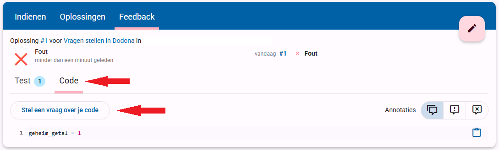
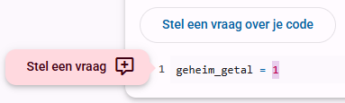
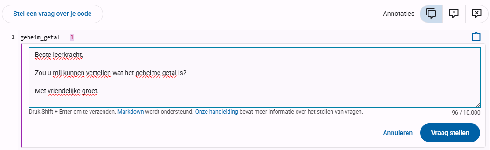
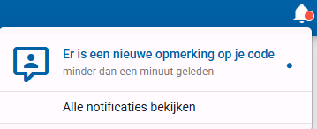
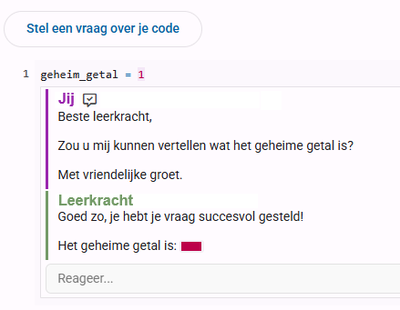

Het kan wel eens voorkomen dat je vragen hebt wanneer je thuis de oefeningen maakt, of dat de leerkracht in de les helaas geen tijd heeft gehad om jouw vraag te beantwoorden. Gelukkig kan je via het Dodona platform direct vragen stellen aan je leerkracht, zodat die ook buiten de les je code kan bekijken om jouw vraag te beantwoorden. Je doet dit in het <i>Feedback</i>-tabblad. 

Je klikt hiervoor eerst op de knop om je code te bekijken, en vervolgens op de knop om een vraag te stellen:

Als je meerdere regels code hebt kan je ook een vraag stellen over een specifieke regel of gedeelte van een regel door het te selecteren. Er komt dan een extra knop tevoorschijn:

Tot slot schrijf je je vraag. Zorg dat je een doordachte vraag stelt, en niet iets zoals <i>"ik snap het niet"</i> of <i>"wat moet ik doen"</i> want dat betekent meestal dat je de opdracht niet goed hebt gelezen. Hier een voorbeeld van de vraag die je in deze opdracht zal stellen:

Vergeet niet op de <i>Vraag stellen</i> knop te klikken, anders wordt het niet verzonden. Wanneer je leerkracht gereageerd heeft dan zal je dit zien aan een notificatie rechtsbovenin de Dodona pagina:

Door hier op te klikken zal je naar het antwoord op je vraag gaan:

 

# <b>Opdracht</b>
1. Dien de code in die er al staat (niet schrikken, dit zal fout zijn).
2. Bekijk het Feedback tabblad en vraag daar aan je leerkracht wat het geheime getal is.
3. Je leerkracht zal de vragen beantwoorden wanneer die hier tijd voor heeft (<i>let op: dit kan ook een andere dag zijn, ga dus ondertussen verder met andere oefeningen</i>).
4. Bekijk het antwoord op je vraag en dien de code opnieuw in met de juiste waarde.