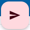
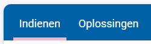
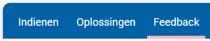

Elke pagina van een Dodona opdracht bestaat uit 3 delen:
1. Het gedeelte met uitleg (je bent dit gedeelte nu aan het lezen),
2. Het gedeelte waar je code kan schrijven en indienen,
3. Het "sandbox" gedeelte, waar je code kan schrijven en kan testen voordat je het indient.

 

# Uitleg gedeelte
Hier wordt, zoals de naam zegt, altijd de opdracht uitgelegd. Je moet de tekst lezen om te weten wat er van je verwacht wordt. 

Soms worden er voorbeelden gegeven van wat jouw programma zou moeten doen in verschillende gevallen, zodat je duidelijker kan zien wat de evaluator verwacht. Dat kan er zo uit zien:

Voorbeeld

<h3><b>Invoer</b></h3>
<pre><code>1+1</code></pre>
<h3><b>Uitvoer</b></h3>
<pre><code>2</code></pre>

 

# Code/indienen gedeelte
In het grijze vak onderaan de pagina schrijf je de code waar de opdracht om vraagt. Wanneer je denkt dat je de juiste code hebt geschreven, dan ga je dit indienen. Dat doe je met de knop rechtsboven het grijze vak: 

Merk op. Voordat je de oefening indient zie je 2 tabbladen:

Maar nadat je hebt ingediend (doe dit maar als je het nog niet gedaan hebt) zie je een extra tabblad:

Je ziet in het Feedback tabblad dat je huidige indiening correct is! We zullen later in deze cursus kijken hoe je dit tabblad kan gebruiken om fouten uit je code te verbeteren (dit heet '<i>debuggen</i>') en hoe je direct in het platform vragen kan stellen aan de leerkracht.

 

# Sandbox gedeelte
Wanneer het <i>Indienen</i> tabblad open staat, zie je rechtsonder het grijze vak deze knop:

Hier zullen we ook later op terugkomen. 

 

# <b>Opdracht</b>
Ergens in deze tekst staat "doe dit ...". Voer uit wat daar staat.