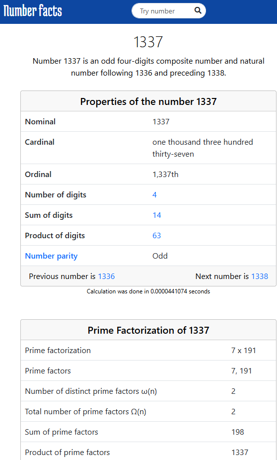

De website [numberfacts.one](https://numberfacts.one/) is een website die allerlei interessante feiten over getallen laat zien. De website is gemaakt door de wiskundige en programmeur Matt Parker. Je kan er bijvoorbeeld de volgende informatie vinden:

In deze opdracht ga je dit een heel klein beetje nabootsen.

# <b>Opdracht</b>
Maak een functie <function name="NummerAnalyse"></function> die twee getallen als invoer neemt.
- Het eerste getal <code>n</code> is het getal dat geanalyseerd moet worden.
- Het tweede getal <code>d</code> komt hieronder meer informatie over.

De functie moet 2 dingen op het scherm afdrukken:
<ol>
  <li>Het product van de cijfers van het eerste getal vergeleken met de som van de cijfers van het eerste getal. 
  <ul>
    <li>Als het product van de cijfers gelijk is aan de som van de cijfers, druk dan af: <code class="string">Het product en de som van de cijfers zijn allebei gelijk aan X.</code></li>
    <li>Als het product van de cijfers groter is dan de som van de cijfers, druk dan af: <code class="string">Het product van de cijfers (X) is groter dan de som van de cijfers (Y).</code></li>
    <li>Als het product van de cijfers kleiner is dan de som van de cijfers, druk dan af: <code class="string">Het product van de cijfers (X) is kleiner dan de som van de cijfers (Y).</code></li>
  </ul>
  </li>
  <li>De deling van het eerste getal door het tweede getal.
  <ul>
    <li>Als het eerste getal deelbaar is door het tweede getal, druk dan af: <code class="string">n is een veelvoud van d.</code></li>
    <li>Als het eerste getal niet deelbaar is door het tweede getal, druk dan af: <code class="string">n is niet deelbaar door d, het resultaat is ongeveer Z.</code></li>
  </ul>
  </li>
</ol>

waarbij X het product van de cijfers is, Y de som van de cijfers is, en Z het resultaat van de deling is afgerond op 2 decimalen.

input-output verwachtingen

<table>
  <thead>
    <tr>
      <th>Invoer</th>
      <th class="padding-column">→</th>
      <th>Verwachte output</th>
      <th>Uitleg</th>
    </tr>
  </thead>
  <tbody>
    <tr>
      <td><function name="NummerAnalyse" inputs='123,7'></function></td>
      <td style="text-align: center;">→</td>
      <td><pre><code>Het product en de som van de cijfers zijn allebei gelijk aan 6.      123 is niet deelbaar door 7, het resultaat is ongeveer 17.57.</code></pre></td>
      <td>Het product van de cijfers van <code>123</code> is $$1 \cdot 2 \cdot 3 = 6$$. De som van de cijfers van <code>123</code> is $$1 + 2 + 3 = 6$$. Het product en de som zijn dus gelijk. $$123 / 7 \approx 17.57$$</td>
    </tr>
    <tr>
      <td><function name="NummerAnalyse" inputs='456,2'></function></td>
      <td style="text-align: center;">→</td>
      <td><pre><code>Het product van de cijfers (120) is groter dan de som van de cijfers (15).      456 is een veelvoud van 2.</code></pre></td>
      <td>Het product van de cijfers van <code>456</code> is $$4 \cdot 5 \cdot 6 = 120$$. De som van de cijfers van <code>456</code> is $$4 + 5 + 6 = 15$$. Het product is dus groter dan de som. $$456 / 2 = 228$$, dus <code>456</code> is exact een veelvoud van <code>2</code>.</td>
    </tr>
    <tr>
      <td><function name="NummerAnalyse" inputs='111112,3'></function></td>
      <td style="text-align: center;">→</td>
      <td><pre><code>Het product van de cijfers (2) is kleiner dan de som van de cijfers (7).      111112 is niet deelbaar door 3, het resultaat is ongeveer 37037.33.</code></pre></td>
      <td>Het product van de cijfers van <code>111112</code> is $$1 \cdot 1 \cdot 1 \cdot 1 \cdot 1 \cdot 2 = 2$$. De som van de cijfers van <code>111112</code> is $$1 + 1 + 1 + 1 + 1 + 2 = 7$$. Het product is dus kleiner dan de som. $$111112 / 3 \approx 37037.33$$</td>
    </tr>
  </tbody>
</table>

 <!-- End of input-output verwachtingen -->

