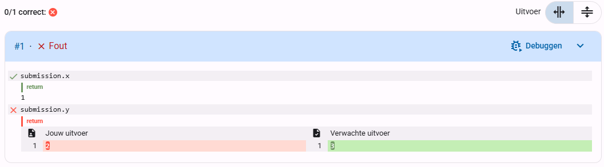

Eerder hebben we het gehad over het Feedback tabblad in het indien-venster onderaan de opdracht. Hier kan je zien wat er goed of fout gaat met jouw code. Zie hieronder een voorbeeld (klik er op om te vergroten):

Je ziet dat de waarde voor <code>x</code> correct is, maar dat de waarde voor <code>y</code> fout is. De leerling heeft <code>y = 2</code> geschreven terwijl er <code>y = 3</code> als antwoord werd verwacht.

<i>Let op het knopje rechtsboven in het Feedback tabblad. Hier kan je kiezen of je jouw output en de verwachte output naast elkaar of onder elkaar wil zetten. Het is meestal overzichtelijker om het naast elkaar te zetten (zoals in de afbeelding hierboven).</i>

# <b>Opdracht</b>
1. Dien de code in die er al staat (niet schrikken, dit zal fout zijn).
2. Bekijk het Feedback tabblad en onderzoek welke waarde voor `x` verwacht wordt door de evaluator.
3. Pas je code aan in het Indienen tabblad naar de juiste waarde voor `x`.
4. Dien je code opnieuw in.